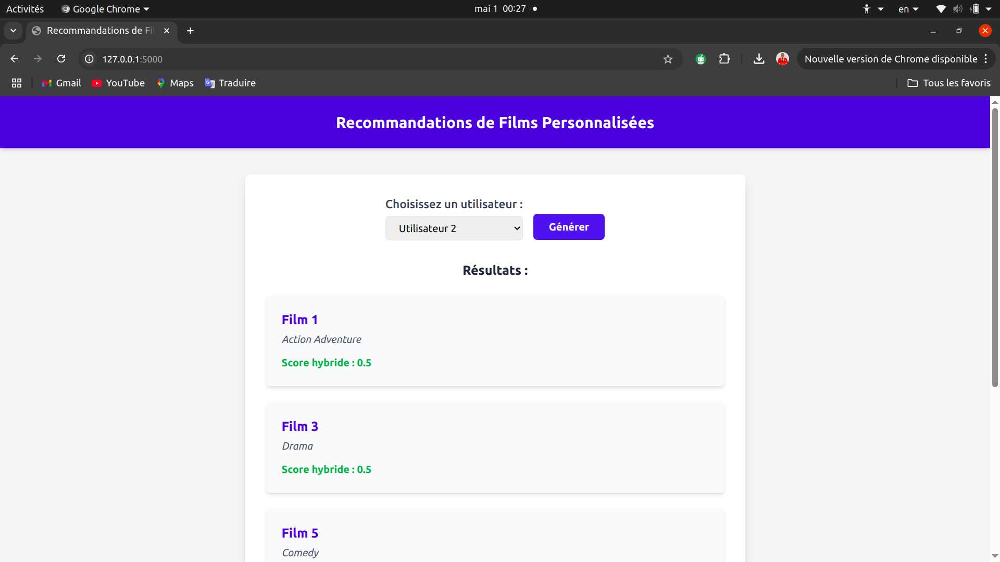

## 🎯 Projet : Système de Recommandation Personnalisée

Ce projet est un **système de recommandation** intelligent capable de proposer des contenus personnalisés à chaque utilisateur, basé sur ses préférences, son historique et ses interactions. Inspiré des modèles utilisés par des plateformes comme **Netflix**, **Amazon** ou **Spotify**, ce système vise à améliorer l’expérience utilisateur en suggérant les éléments les plus pertinents pour chacun.

### ✨ Fonctionnalités principales

- 🔍 Analyse des préférences utilisateurs (clics, évaluations, historique, etc.)
- 🤖 Utilisation de modèles de recommandation : filtrage collaboratif, filtrage basé sur le contenu
- 📊 Score de pertinence et classement personnalisé des contenus
- 🌐 Interface web 

### 🧠 Technologies utilisées

- Python (pandas, scikit-learn, etc.)
- Flask pour l’API
- HTML/CSS/Tailwind CSS pour l’interface

### 🖼️ Aperçu de l’interface

### 🚀 Objectifs pédagogiques

- Comprendre le fonctionnement des algorithmes de recommandation
- Implémenter un système capable d’adapter ses résultats à chaque utilisateur
- Déployer une solution simple et efficace avec une interface interactive
